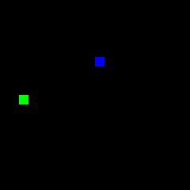

# Snake

An OpenAI gym environment made to resemble the classic snake game.

Example usage:

import gym
import snake

env = gym.make("Snake-v0")

Live rendering is not supported yet. 

To save experience to gif

env.save("out.gif")

Example output:

